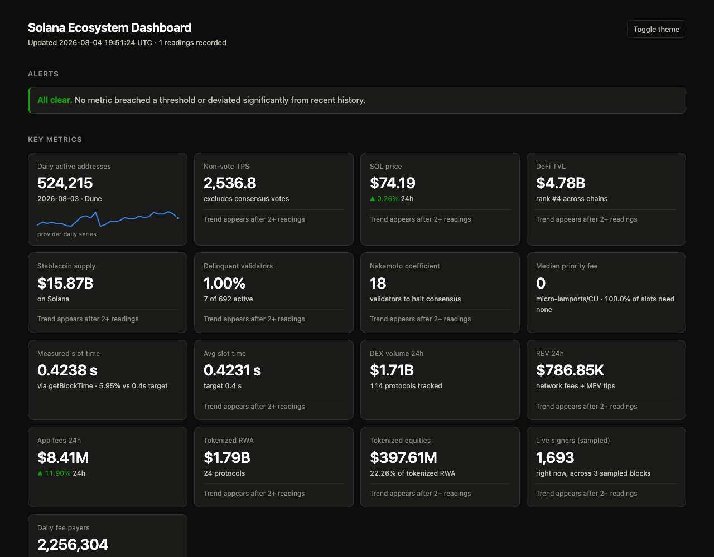

# SolVitals

**→ [Live dashboard](https://techbronick.github.io/solvitals/)** — refreshes itself every 15 minutes.

[](https://techbronick.github.io/solvitals/)

An auto-updating report on the state of the Solana ecosystem. One command
collects on-chain and economic data, checks it for anomalies, and writes three
outputs: an interactive HTML dashboard, a human-readable Markdown report, and
machine-readable JSON.

It also tracks protocol upgrades through to **live feature-gate activation**
across mainnet, testnet and devnet — so it reports what is actually switched on,
not just what has been proposed. Two things that surfaced: mainnet is running a
different Agave version from testnet and devnet, and Alpenglow has no feature
gate on any cluster, meaning it is not switchable anywhere yet.

**Zero dependencies.** Python 3.7+ standard library only — no `pip install`, no
API keys, no accounts. Clone and run.

```bash
git clone https://github.com/techbronick/solvitals && cd solvitals
python3 main.py
open output/index.html
```

## Outputs

| File | Purpose |
|---|---|
| `output/index.html` | Interactive dashboard — dark theme, sparklines with hover tooltips, full metric tables |
| `output/report.md` | Markdown report suitable for pasting into Notion, GitHub, or a newsletter |
| `output/report.json` | Structured data for downstream tooling |
| `output/history.jsonl` | Append-only metric history; the baseline for anomaly detection |

## Usage

```bash
python3 main.py                        # single run
python3 main.py --watch                # refresh continuously (default 300s)
python3 main.py --watch --interval 60  # custom refresh interval
python3 main.py --output-dir public    # write somewhere else
```

Every setting is also an environment variable, so the collector runs unchanged
under cron, systemd, or CI:

| Variable | Default | Purpose |
|---|---|---|
| `SOLVITALS_RPC_URL` | `api.mainnet-beta.solana.com` | Primary RPC endpoint |
| `SOLVITALS_RPC_FALLBACKS` | `solana-rpc.publicnode.com` | Comma-separated fallbacks |
| `SOLVITALS_REFRESH_INTERVAL` | `300` | Seconds between refreshes in watch mode |
| `SOLVITALS_PERF_SAMPLES` | `5` | 60s performance samples averaged for TPS |
| `SOLVITALS_OUTPUT_DIR` | `output` | Output directory |
| `SOLVITALS_HISTORY_WINDOW` | `288` | Trailing history points used as the anomaly baseline |
| `SOLVITALS_PROTOCOLS_TTL` | `21600` | Cache TTL in seconds for the DeFiLlama protocol list |
| `SOLVITALS_ADDRESS_SAMPLE_BLOCKS` | `3` | Blocks sampled for the address-activity estimate |
| `SOLVITALS_ADDRESS_SAMPLE_SPACING` | `1500` | Slot spacing between sampled blocks |

## Data sources

Priority was given to sources that need no key and no third-party package.

| Section | Source | Method | Key |
|---|---|---|---|
| TPS, slot time, block height | Solana JSON-RPC | `getRecentPerformanceSamples`, `getBlockHeight`, `getSlot` | No |
| Epoch progress | Solana JSON-RPC | `getEpochInfo` | No |
| Validators, stake, delinquency | Solana JSON-RPC | `getVoteAccounts` | No |
| Supply | Solana JSON-RPC | `getSupply` | No |
| Node health | Solana JSON-RPC | `getHealth` | No |
| Address activity | Solana JSON-RPC | `getBlock` over sampled slots | No |
| SOL price, market cap | CoinGecko public API | REST | No |
| DeFi TVL, chain rank | DeFiLlama | REST | No |
| DEX volume, top DEXes | DeFiLlama | REST | No |
| Stablecoin supply | DeFiLlama | REST | No |
| Network fees (REV) | DeFiLlama | REST | No |
| Tokenized RWA and equities | DeFiLlama | REST (cached 6h) | No |

### How they're integrated

Each source is a function that returns a dict or raises `FetchError`. Collectors
run through a wrapper that catches failures **per section**, so a DeFiLlama
outage costs you the TVL tile and nothing else — the rest of the report still
renders, and the failed section shows why. Transport errors and 429/5xx
responses retry with exponential backoff; RPC calls additionally fail over to
secondary endpoints before giving up.

### Metrics chosen deliberately

- **Non-vote TPS is the headline, not raw TPS.** Solana counts consensus votes
  as transactions, so the raw figure runs well above the number people mean by
  "TPS" -- about 1.8x currently. Both are reported; the honest one leads.
- **Nakamoto coefficient** — how many validators would need to collude to reach
  33% of stake and halt consensus. A single number for decentralisation that
  validator *count* alone doesn't capture.
- **Delinquent stake, not just delinquent count.** Seven delinquent validators
  holding 0.001% of stake is noise; seven holding 15% is an incident.
- **Tokenized equities are broken out from RWA.** The RWA category is dominated
  by treasuries and private credit — BlackRock BUIDL alone is a third of it — so
  a single RWA total hides what's happening in tokenized equities specifically.
  Equity issuers (xStocks, Ondo Global Markets) are separated and reported both
  in absolute terms and as a share.
- **Fees are labelled the fee component of REV, not REV.** Real Economic Value
  is conventionally fees plus out-of-protocol MEV tips. Tip data needs a keyed
  source, so what's collected is fees, and the report says so rather than
  overstating the number.

### On active addresses — two measurements, deliberately

The report gives **both** a true daily active address count and a live sample,
because they answer different questions.

**Daily active addresses** come from solana.com's own data API, deduplicated
across the full day by the provider, and attributed to that provider. This is the
number people mean by "daily active addresses", and it cannot be derived from
RPC — deduplicating signers across ~216,000 blocks per day is not something a
per-run collector can do.

**Sampled unique fee payers** come from `getBlock` over a spread of recent
slots. This is *not* a daily figure and isn't presented as one. It measures how
many distinct addresses are transacting right now, which the daily number can't
show because it lags by a day. Sample width and spacing are configurable via
`SOLVITALS_ADDRESS_SAMPLE_BLOCKS` and `SOLVITALS_ADDRESS_SAMPLE_SPACING`.

Reporting both, clearly labelled, beats picking one and hoping the reader
assumes the other.

### Provider divergence — where sources disagree

solana.com's feed carries the same metric from multiple providers, each with its
own methodology, and they do not always agree. Rather than silently picking one,
the collector flags any metric where providers measuring the same day differ by
more than a configurable threshold (default 15%).

This is live, not hypothetical: Dune and Allium currently differ by ~25% on
daily active addresses, and DEX volume figures diverge far more widely depending
on which venues a provider counts. A dashboard that showed one number without
that caveat would be quietly misleading.

### Upcoming upgrades — tracked to live activation

Most ecosystem dashboards report what the chain *is doing*. This also reports
what is about to change, by joining three keyless sources:

1. **The SIMD repository** — every Solana Improvement Document with its status
   and, where assigned, the feature-gate pubkey that switches it on. Fetched as
   a single tarball rather than per-file API calls, which sidesteps GitHub's
   unauthenticated rate limit — shared CI runner IPs exhaust that budget
   routinely.
2. **Agave's `feature-set` source** — maps gate pubkeys to readable names.
3. **The chain itself** — `getMultipleAccounts` on those pubkeys, across
   mainnet, testnet and devnet. The account is 9 bytes: an Option tag plus a
   little-endian activation slot.

That answers a question a static proposal list cannot: not "what has been
proposed" but "what is switched on, on which cluster, right now". A gate live on
devnet but absent on mainnet is a change in flight.

Two live findings at time of writing: mainnet runs a different Agave version
from testnet and devnet, which is itself a rollout signal; and Alpenglow
(SIMD-0326, plus three related proposals) has no feature gate assigned on any
cluster yet, so it is not switchable anywhere — a more precise statement than
"upcoming".

Note the bounty writes "SIMD-525"; the repository zero-pads to four digits, so
the proposal is SIMD-0525 ("Reduce Slot Times", Draft).

### REV, and why the obvious number is wrong

DeFiLlama's chain-level `total24h` for Solana is **not** network fees — it is the
sum across all ~283 protocols on Solana, including DEXes, launchpads, wallets and
Telegram bots. Reporting that as network revenue overstates it by more than 10x.

Network fees are the single `category == "Chain"` row. Out-of-protocol MEV tips
are the `category == "MEV"` rows, Jito being most of it. REV is the sum of those
two, and both arrive in a payload this project already downloads — no key, no
extra request.

So the report gives **REV = network fees + MEV tips**, with the components shown
separately, and reports protocol-wide fees as `app_fees`, clearly labelled as a
different quantity. Currently REV runs around $790K/day against roughly $8.4M in
application fees — two real numbers that answer two different questions.

### Caching

DeFiLlama's full protocol list is roughly 8 MB and its RWA figures move on a
daily cadence. Re-downloading it every refresh would dominate run time and be
rude to a free API, so it's cached on disk with a 6-hour TTL
(`SOLVITALS_PROTOCOLS_TTL`). Cache writes are atomic, corrupt cache files fall
through to a refetch, and a stale cache is used as the fallback when the network
call fails — so the section stays populated through a transient outage.

## Automation strategy

Three deployment shapes, in increasing order of how hands-off they are:

**1. Watch mode** — a long-running process, best behind systemd:

```ini
[Unit]
Description=SolVitals
After=network-online.target

[Service]
ExecStart=/usr/bin/python3 /opt/solvitals/main.py --watch --interval 300
WorkingDirectory=/opt/solvitals
Restart=always

[Install]
WantedBy=multi-user.target
```

**2. Cron** — for a periodic single run:

```cron
*/5 * * * * cd /opt/solvitals && /usr/bin/python3 main.py --quiet
```

**3. GitHub Actions** — refreshes and publishes to Pages with no server at all.
Commit `.github/workflows/refresh.yml`:

```yaml
name: refresh
on:
  schedule: [{cron: "*/15 * * * *"}]
  workflow_dispatch:
permissions: {contents: write}
jobs:
  build:
    runs-on: ubuntu-latest
    steps:
      - uses: actions/checkout@v4
      - run: python3 main.py --output-dir docs --quiet
      - run: |
          git config user.name github-actions
          git config user.email github-actions@github.com
          git add docs && git diff --staged --quiet || git commit -m "refresh"
          git push
```

History accumulates in the committed `history.jsonl`, so sparklines and anomaly
baselines survive across runs even though each run starts on a fresh runner.

State is a plain append-only JSONL file rather than a database: it survives
partial writes, corrupt lines are skipped on read, and it stays inspectable with
`tail`.

## Anomaly detection

Two complementary checks run on every refresh. Both are needed — thresholds
alone miss a TVL collapse that stays numerically "large", while z-scores alone
stay quiet when a metric is consistently bad.

**Absolute thresholds** — conditions that are wrong regardless of history:

| Metric | Warning | Critical |
|---|---|---|
| Delinquent validators | ≥ 5% | ≥ 10% |
| Average slot time | ≥ 0.65 s | ≥ 0.9 s |
| Non-vote TPS | ≤ 800 | ≤ 400 |
| Nakamoto coefficient | ≤ 14 | ≤ 10 |
| RPC health | — | any non-`ok` status |

**Statistical deviation** — a metric more than 2σ (warning) or 3σ (critical)
from its own trailing mean, applied to non-vote TPS, SOL price, TVL, stablecoin
supply, network fees, tokenized RWA, tokenized equities, and sampled active
addresses. Needs at least 8 history points before it will fire, so a fresh
install doesn't alarm on itself.

The current reading is appended to history *after* detection runs, so a value is
never part of the baseline it's measured against.

Findings are sorted most-severe-first and lead both the dashboard and the
Markdown report — if something is wrong, it should be the first thing you read.

## Dashboard

- **Dark theme by default**, with a toggle; light mode is a separately chosen
  set of steps validated against the light surface, not an automatic inversion.
- **Sparklines** on every tile with a history series, showing hover crosshair,
  value and timestamp. A tile with fewer than two readings says so rather than
  drawing a misleading flat line.
- **Colour never carries meaning alone.** Severity is always paired with a text
  label; every tile value also appears in the "All metrics" table for
  screen-reader and colourblind readers.
- Fully self-contained: no CDN, no fonts, no network calls at view time. Open
  `index.html` from disk or serve it statically.

## Known limits

Stated plainly, because a dashboard that hides its own uncertainty is worse than
one that admits it.

- **Priority-fee samples can read zero.** `getRecentPrioritizationFees` returns
  the per-slot *minimum*, and when the network is uncongested that is legitimately
  0 across all 150 slots. The report shows the percentile spread and the share of
  slots needing no fee, so a zero median is interpretable rather than suspicious.
- **Local history starts empty.** Sparklines fed by this instance's own polling
  need several runs before they mean anything, and the z-score detector needs 8
  points. Tiles say so rather than drawing a line through one value. Metrics
  sourced from solana.com arrive with the provider's own daily series and are
  labelled separately, so they show a real trend immediately.
- **Provider figures disagree.** Allium and Dune currently differ by roughly 25%
  on daily active addresses. Neither is wrong; they count differently. The report
  flags the gap instead of silently picking one.
- **X/Twitter ingestion is best-effort.** The keyless syndication endpoint
  rate-limits roughly one request in five. A miss degrades that section only.
- **No sentiment scoring.** Without a model it would be keyword counting
  presented as analysis.
- **Tokenized assets are reported as value outstanding, not traded volume.**
  DeFiLlama exposes TVL per protocol; the brief asked for volumes. The
  distinction is stated rather than blurred.
- **The public mainnet RPC rate-limits** under a 15-minute cadence from shared CI
  IPs. Collectors degrade per-section and retry; a private endpoint is advisable
  for anything heavier.

## Tests

```bash
python3 -m unittest discover -s tests -v
```

16 tests over the pure logic -- anomaly thresholds, z-score behaviour on flat
and moving baselines, finding severity order, and history load/append including
corrupt-line tolerance. Network collectors aren't unit-tested; what matters
there is that malformed responses degrade one section instead of killing the
run, which is covered by the isolation described above.

## Project layout

```
main.py                      entry point
solvitals/
  cli.py                     argument parsing, run loop, output writing
  config.py                  settings, all env-overridable
  net.py                     stdlib HTTP with retry/backoff
  store.py                   append-only JSONL history
  anomalies.py               threshold + z-score detection
  collectors/
    rpc.py                   on-chain metrics via Solana JSON-RPC
    market.py                price, TVL, DEX volume, stablecoins, fees, RWA
    ecosystem.py             solana.com/data (incl. Dune-computed metrics)
    news.py                  official Solana news RSS
  render/
    markdown.py              Markdown report
    html.py                  self-contained interactive dashboard
tests/
  test_core.py               unit tests for anomalies and history
```

Collectors don't know about renderers, and renderers don't know where data came
from — both sides talk through the plain snapshot dict, so adding a source or an
output format touches one file.

## Sample output

**Live dashboard: [techbronick.github.io/solvitals](https://techbronick.github.io/solvitals/)** —
refreshed every 15 minutes by GitHub Actions.

Committed samples of all three output formats:

- [`docs/index.html`](docs/index.html) — the dashboard (also served live above)
- [`docs/report.md`](docs/report.md) — Markdown report
- [`docs/report.json`](docs/report.json) — structured JSON
- [`docs/history.jsonl`](docs/history.jsonl) — accumulated metric history

Running locally writes the same set to `output/`, which is gitignored so the
repo only carries the published copies in `docs/`.

## License

MIT
